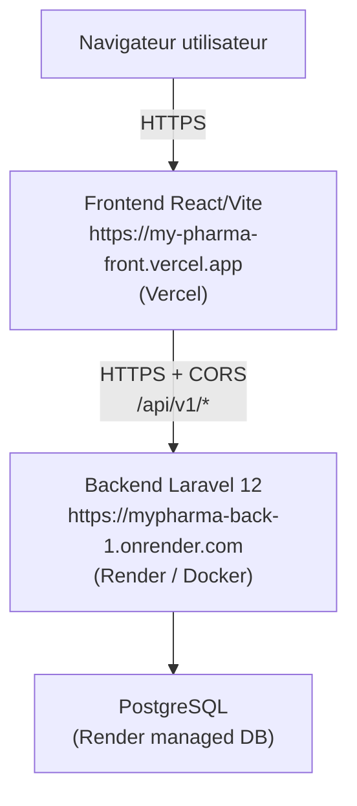
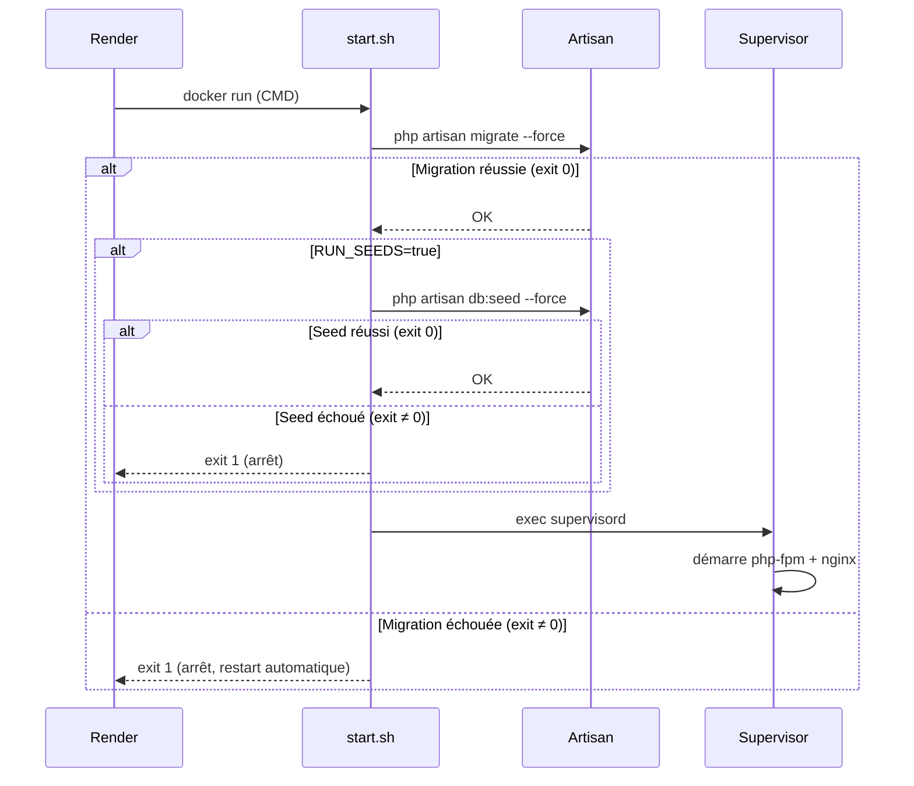
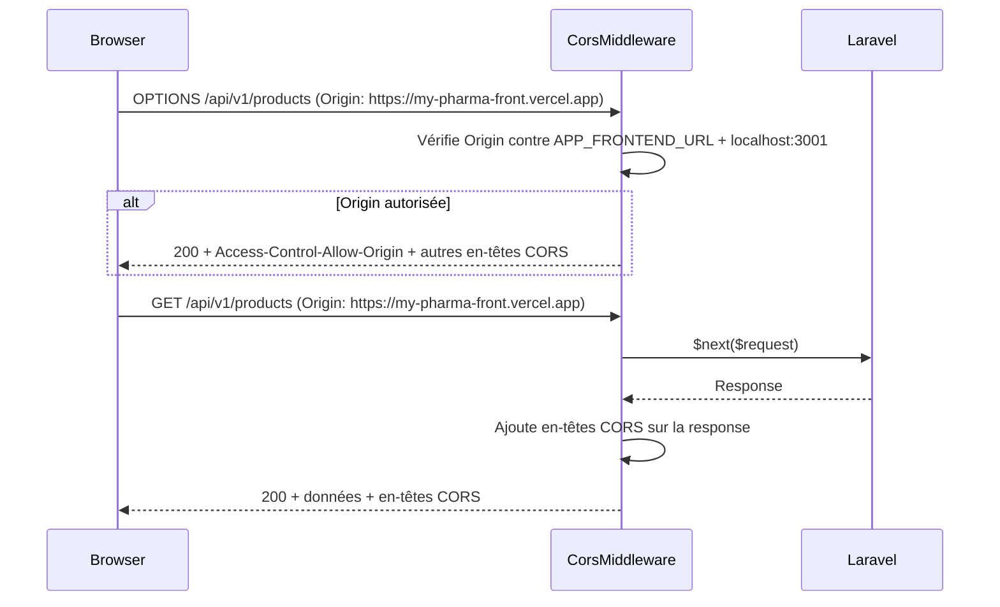

# Design Document — deployment-fix

## Overview

L'application MyPharma est une API Laravel 12 (Backend) déployée sur Render et un frontend React/Vite déployé sur Vercel. Six défauts de configuration empêchent actuellement la communication entre les deux services : URL d'API incorrecte côté frontend, absence de migration automatique au démarrage du backend, configuration CORS ambiguë avec risque de doublons d'en-têtes, et variables d'environnement manquantes ou erronées dans `render.yaml`.

Ce document décrit les modifications techniques précises à apporter à chacun de ces six points pour rétablir le fonctionnement complet de l'application en production.

---

## Architecture

### Vue d'ensemble du système



### Flux de démarrage du conteneur



### Flux d'une requête CORS



---

## Components and Interfaces

### 1. Frontend — Configuration Axios (`src/api/client.ts` ou `src/api/axios.js`)

**Situation actuelle** : L'URL de base est soit codée en dur, soit lue avec un fallback silencieux vers `localhost`.

**Modification requise** : Lire exclusivement `import.meta.env.VITE_API_BASE_URL`, consigner un avertissement si absent.

```typescript
// src/api/client.ts
const apiBaseUrl = import.meta.env.VITE_API_BASE_URL;

if (!apiBaseUrl) {
  console.warn(
    '[MyPharma] VITE_API_BASE_URL is not defined. ' +
    'All API requests will fail. Check your environment variables.'
  );
}

const apiClient = axios.create({
  baseURL: apiBaseUrl,   // sera "undefined" string si absent → échec visible
  withCredentials: true,
  headers: {
    'Content-Type': 'application/json',
    'Accept': 'application/json',
  },
});
```

**Remarque** : Ne pas ajouter de fallback `|| 'http://localhost:8000/api/v1'` — cela masquerait l'erreur de configuration en production.

### 2. Backend — Script de démarrage (`docker/start.sh`)

**Situation actuelle** : Le `CMD` du Dockerfile lance directement `supervisord`, sans exécuter de migrations au préalable.

**Modification requise** : Créer un script `docker/start.sh` qui exécute les migrations (et optionnellement les seeds) avant de passer la main à Supervisor.

```bash
#!/bin/sh
set -e   # Arrêt immédiat sur toute erreur (exit code ≠ 0)

echo "[start.sh] Running migrations..."
php artisan migrate --force

if [ "$RUN_SEEDS" = "true" ]; then
  echo "[start.sh] RUN_SEEDS=true — Running seeders..."
  php artisan db:seed --force
fi

echo "[start.sh] Starting web server..."
exec /usr/bin/supervisord
```

Le `set -e` en tête du script garantit que si `migrate` ou `db:seed` échoue, le script s'arrête avec un code non-zéro, ce qui provoque un redémarrage automatique par Render.

**Modification dans le Dockerfile** :

```dockerfile
COPY docker/start.sh /usr/local/bin/start.sh
RUN chmod +x /usr/local/bin/start.sh

CMD ["/usr/local/bin/start.sh"]
```

### 3. Backend — `CorsMiddleware` (`app/Http/Middleware/CorsMiddleware.php`)

**Situation actuelle** : Le middleware autorise n'importe quelle origine (`$request->header('Origin') ?: '*'`).

**Modification requise** :

```php
<?php

namespace App\Http\Middleware;

use Closure;
use Illuminate\Http\Request;
use Symfony\Component\HttpFoundation\Response;

class CorsMiddleware
{
    private function getAllowedOrigins(): array
    {
        $origins = ['http://localhost:3001'];

        $frontendUrl = env('APP_FRONTEND_URL');
        if ($frontendUrl) {
            $origins[] = rtrim($frontendUrl, '/');
        }

        return $origins;
    }

    public function handle(Request $request, Closure $next): Response
    {
        $origin = $request->header('Origin');
        $allowedOrigins = $this->getAllowedOrigins();

        if (!$origin || !in_array($origin, $allowedOrigins, true)) {
            if ($request->getMethod() === 'OPTIONS') {
                return response('', 204);
            }
            return $next($request);
        }

        $headers = [
            'Access-Control-Allow-Origin'      => $origin,
            'Access-Control-Allow-Methods'     => 'GET, POST, PUT, PATCH, DELETE, OPTIONS',
            'Access-Control-Allow-Headers'     => 'Content-Type, Authorization, Accept, Origin, X-Requested-With',
            'Access-Control-Allow-Credentials' => 'true',
            'Access-Control-Max-Age'           => '86400',
        ];

        if ($request->getMethod() === 'OPTIONS') {
            return response('', 200, $headers);
        }

        $response = $next($request);

        foreach ($headers as $key => $value) {
            $response->headers->set($key, $value);
        }

        return $response;
    }
}
```

### 4. Backend — `bootstrap/app.php`

**Vérification requise** : Confirmer qu'aucun `HandleCors` n'est ajouté. Seul `CorsMiddleware` doit être enregistré via `$middleware->prepend(...)`.

### 5. Backend — `config/cors.php`

**Modification requise** : Mettre `allowed_origins` à `[]` pour éviter tout doublon d'en-têtes si `HandleCors` était activé par erreur.

```php
return [
    'paths' => ['api/*', 'sanctum/csrf-cookie'],
    'allowed_methods' => ['GET', 'POST', 'PUT', 'PATCH', 'DELETE', 'OPTIONS'],
    'allowed_origins' => [],        // Non utilisé — CorsMiddleware gère le CORS
    'allowed_origins_patterns' => [],
    'allowed_headers' => ['Content-Type', 'Authorization', 'Accept', 'Origin', 'X-Requested-With'],
    'exposed_headers' => [],
    'max_age' => 86400,
    'supports_credentials' => true,
];
```

### 6. Backend — `render.yaml`

**État cible** :

```yaml
services:
  - type: web
    name: mypharma-api
    env: docker
    plan: free
    dockerContext: .
    dockerfilePath: ./Dockerfile
    envVars:
      - key: APP_ENV
        value: production
      - key: APP_DEBUG
        value: false
      - key: APP_KEY
        generateValue: true
      - key: APP_URL
        value: https://mypharma-back-1.onrender.com      # corrigé
      - key: APP_FRONTEND_URL
        value: https://my-pharma-front.vercel.app        # nouveau
      - key: SANCTUM_STATEFUL_DOMAINS
        value: my-pharma-front.vercel.app                # nouveau (sans scheme)
      - key: SESSION_DOMAIN
        value: .onrender.com                             # nouveau
      - key: DB_CONNECTION
        value: pgsql
      # RUN_SEEDS=true à définir manuellement via le dashboard Render si nécessaire

databases:
  - name: mypharma-db
    databaseName: mypharma
    user: mypharma_user
    plan: free
```

### 7. Frontend — `.env.example`

```env
# Production (Vercel)
VITE_API_BASE_URL=https://mypharma-back-1.onrender.com/api/v1

# Développement local (décommenter et ajuster)
# VITE_API_BASE_URL=http://localhost:8000/api/v1
```

### 8. Seeders — Idempotence (`database/seeders/`)

```php
// Exemple dans CategorySeeder
Category::firstOrCreate(
    ['slug' => 'antibiotiques'],
    ['name' => 'Antibiotiques', 'description' => '...']
);

// Exemple dans UserSeeder (admin)
User::firstOrCreate(
    ['email' => 'admin@mypharma.com'],
    ['name' => 'Admin', 'password' => Hash::make('...'), 'role' => 'admin']
);

// Exemple dans StockSeeder
Stock::updateOrCreate(
    ['pharmacy_id' => $pharmacy->id, 'product_id' => $product->id],
    ['quantity' => $qty, 'price' => $price]
);
```

---

## Data Models

Aucun changement de modèle de données n'est requis.

### Mapping des variables d'environnement

| Variable | Fichier source | Valeur de production | Rôle |
|---|---|---|---|
| `VITE_API_BASE_URL` | Vercel Dashboard | `https://mypharma-back-1.onrender.com/api/v1` | URL de base Axios (frontend) |
| `APP_URL` | `render.yaml` | `https://mypharma-back-1.onrender.com` | URL canonique du backend |
| `APP_FRONTEND_URL` | `render.yaml` | `https://my-pharma-front.vercel.app` | Origine CORS autorisée |
| `SANCTUM_STATEFUL_DOMAINS` | `render.yaml` | `my-pharma-front.vercel.app` | Domaines stateful Sanctum (sans scheme) |
| `SESSION_DOMAIN` | `render.yaml` | `.onrender.com` | Domaine des cookies de session |
| `RUN_SEEDS` | Render Dashboard (manuel) | `true` (premier déploiement seulement) | Active le seeding au démarrage |

---

## Correctness Properties

### Property 1: CorsMiddleware renvoie l'origine exacte pour les origines autorisées

Pour toute requête HTTP portant un `Origin` dans la liste autorisée, la réponse SHALL contenir `Access-Control-Allow-Origin` avec cette valeur exacte.

**Validates: Requirements 3.1, 5.2**

### Property 2: CorsMiddleware inclut Access-Control-Allow-Credentials pour les origines autorisées

Pour toute requête HTTP portant un `Origin` reconnu, la réponse SHALL contenir `Access-Control-Allow-Credentials: true`.

**Validates: Requirements 3.2**

### Property 3: CorsMiddleware n'émet pas d'en-tête CORS pour les origines non autorisées

Pour toute valeur d'`Origin` qui n'est ni `APP_FRONTEND_URL` ni `http://localhost:3001`, la réponse SHALL ne pas contenir `Access-Control-Allow-Origin`.

**Validates: Requirements 3.5**

### Property 4: Les seeders sont idempotents

Pour toute base contenant déjà des données seedées, exécuter `db:seed --force` une seconde fois SHALL produire exactement le même nombre d'enregistrements.

**Validates: Requirements 2.6**

---

## Error Handling

- **Migration échouée** : `set -e` arrête `start.sh` immédiatement → Render redémarre le conteneur.
- **VITE_API_BASE_URL absente** : `baseURL: undefined` → requêtes échouent visiblement + `console.warn`.
- **APP_FRONTEND_URL absente** : `getAllowedOrigins()` retourne uniquement `localhost:3001` → toute requête de production est bloquée (fail-closed).
- **Doublons CORS éliminés** : `HandleCors` non enregistré + `allowed_origins: []` dans `config/cors.php`.

---

## Testing Strategy

### Tests unitaires PHPUnit (Backend)

| # | Test | Type |
|---|---|---|
| U1 | OPTIONS avec origin autorisée → 200 + tous les en-têtes CORS | Example |
| U2 | GET avec `APP_FRONTEND_URL` défini → header exact | Example |
| U3 | GET avec `APP_FRONTEND_URL` absent → aucun header CORS | Example |
| P1 | Property 1 : origin exacte pour chaque origine autorisée | PBT |
| P2 | Property 2 : credentials pour chaque origine autorisée | PBT |
| P3 | Property 3 : aucun header pour origines arbitraires | PBT |
| P4 | Property 4 : seeders idempotents (double seed = mêmes counts) | PBT |

### Tests Vitest (Frontend)

| # | Test | Type |
|---|---|---|
| F1 | `baseURL` lit `VITE_API_BASE_URL` | Example |
| F2 | Variable absente → `console.warn` appelé | Example |
| F3 | Variable absente → `baseURL === undefined` | Example |
